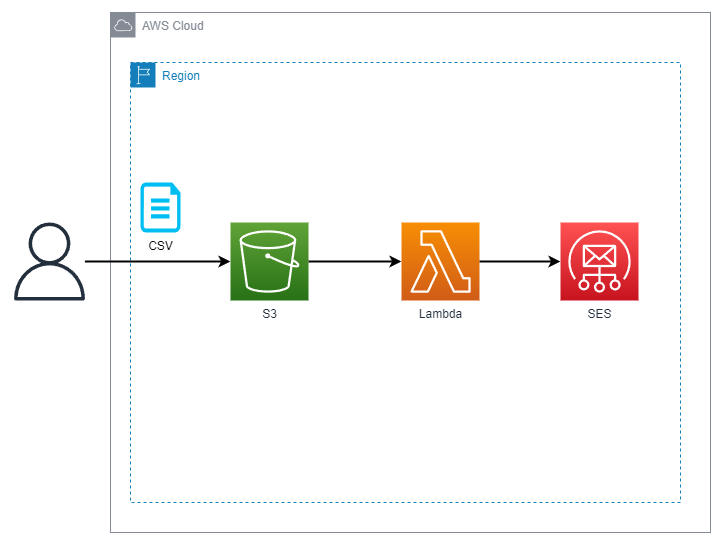

# Curso AWS Lambda com Python e Serverless Framework
# Projeto 2

Neste projeto nós automatizamos o envio de email com SES usando uma Lambda executada com um arquivo que chega no S3.

## Considerações para execução deste projeto

- Baixe este repositório.
- Acesse a pasta do **projeto-2**.
- Atualize arquivo serverless.yml com suas credentiais e região da AWS que quer usar, como no código abaixo.

```yaml
provider:
  name: aws
  runtime: python3.11
  profile: automacao-curso
  region: us-east-1
  ...
```
- No arquivo **handler.py** atualize com seu email o parâmetro **Source** da função **enviar_email**, apresentado abaixo.

```python
def enviar_email(nome, email):
    
    cliente_ses.send_email(
        Source='MEU_EMAIL@gmail.com',
        Destination={
            'BccAddresses': [],
            'CcAddresses': [],
            'ToAddresses': [
                email
            ]
        },
...
```
- Atulize nos arquivos **usuarios.csv** e **usuarios_v2.csv** com a lista de emails que deseja usar.
- Se for executar localmente o código Python não esqueça de criar, ativar e instalar os requisitos do ambiente
```bash
~/projeto-3/> python -m venv env
~/projeto-3/> .\env\Scripts\activate
~/projeto-3/> pip install -r requirements.txt
```
- Execute o comando **deploy** para criar a infra na AWS.
```bash
~/projeto-2/> serverless deploy
```
- Para remover toda a infra criada, execute o comando **remove**.
```bash
~/projeto-2/> serverless remove
```

## Diagrama

